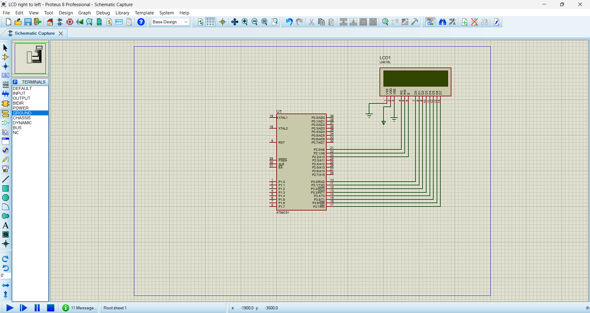
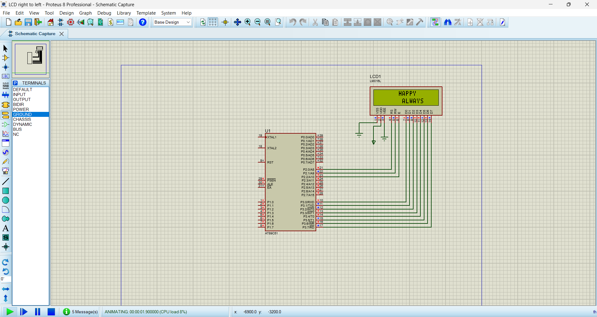

# LCD String Scrolling (Right to Left) using 8051

## Description

This project demonstrates right-to-left text scrolling on a 16×2 LCD using the AT89C51 (8051) microcontroller. The message continuously scrolls across the LCD display.

## Components Used

- AT89C51 / 8051 Microcontroller
- 16×2 LCD (LM016L)
- Proteus 8 Professional
- Keil uVision

## Software Used

- Keil uVision
- Proteus 8 Professional

## Circuit Diagram

## Output

## Source Code

- `03_lcd_string_scrolling.c`

## Working

- Initializes the LCD.
- Displays the message.
- Scrolls the message from right to left.
- Repeats continuously.

## Author

**Thirishika M**
